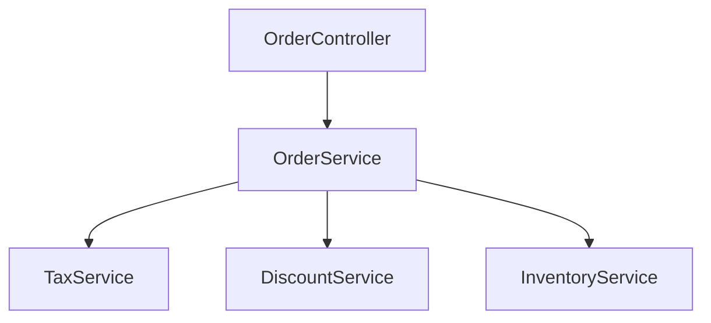

## Overview

This skill systematically identifies, extracts, and documents all business logic from a source codebase to enable accurate rewrite in a new technology stack. The goal is to ensure **functional equivalence** - the rewritten application produces the same business outcomes.

## User Input

```text
```

You **MUST** consider the user input before proceeding (if not empty).

## When to Use

- **Mode**: REWRITE only
- **Phase**: Planning Phase 0 (Research) — invoked by planning skill
- **Prerequisites**: Constitution defined, Knowledge graph available

## Extraction Process

### Step 1: Extract Business Logic Units

For each business logic unit, document:

```yaml
business_logic_unit:
  id: "BL-001"
  name: "Order Total Calculation"
  category: "calculation"
  source_location: "src/main/java/com/example/service/OrderService.java:45-78"
  source_methods: ["calculateTotal", "applyDiscount", "calculateTax"]
  
  description: |
    Calculates the total order amount including:
    - Item subtotals
    - Tax calculation based on region
    - Discount application
    - Shipping cost
  
  inputs:
    - name: "orderItems"
      type: "List<OrderItem>"
      description: "Items in the order with quantity and price"
    - name: "customerRegion"
      type: "String"
      description: "Customer's geographic region for tax calculation"
    - name: "discountCode"
      type: "String"
      optional: true
      description: "Optional promotional discount code"
  
  outputs:
    - name: "orderTotal"
      type: "BigDecimal"
      description: "Final order total after all calculations"
    - name: "taxAmount"
      type: "BigDecimal"
      description: "Calculated tax amount"
  
  dependencies:
    - "TaxService - for tax rate lookup"
    - "DiscountService - for discount validation"
  
  business_rules:
    - "Tax is calculated on subtotal before discount"
    - "Maximum discount is 50% of subtotal"
    - "Free shipping for orders over $100"
  
  # Behavioral specification: precise branch-level logic extracted from source code
  # Each entry documents one conditional branch or behavioral path
  behavioral_spec:
    - condition: "orderItems.isEmpty()"
      action: "return BigDecimal.ZERO"
      branch_type: "early_return"
    - condition: "discountCode != null && discountService.isValid(discountCode)"
      action: "subtotal * (1 - discount.percentage / 100)"
      constraint: "discountedAmount <= subtotal * 0.5"
    - condition: "discountCode != null && !discountService.isValid(discountCode)"
      action: "ignore discount, use full subtotal"
      error_response: "none (silent ignore)"
    - condition: "subtotal > 100.00"
      action: "shipping = 0"
    - condition: "subtotal <= 100.00"
      action: "shipping = flatShippingRate"
  
  # Data validation rules from source code
  validation_rules:
    - field: "orderItems"
      rules: ["NOT_NULL", "NOT_EMPTY"]
    - field: "orderItems[].quantity"
      rules: ["MIN: 1", "MAX: 999"]
    - field: "orderItems[].price"
      rules: ["NOT_NULL", "MIN: 0.01"]
    - field: "discountCode"
      rules: ["OPTIONAL", "PATTERN: ^[A-Z0-9]{6,12}$"]
  
  # Side effects produced by this logic
  side_effects:
    - "Audit log entry created for discount application"
    - "Order total cached in session"
  
  edge_cases:
    - "Empty order returns zero total"
    - "Invalid discount code is ignored, not error"
    - "International orders have different tax rules"
  
  test_scenarios:
    - description: "Basic order with tax"
      input: "3 items, US region, no discount"
      expected_output: "subtotal + 8.5% tax"
    - description: "Order with discount"
      input: "3 items, discount code 'SAVE20'"
      expected_output: "subtotal - 20% + tax"
    - description: "Empty order"
      input: "0 items"
      expected_output: "BigDecimal.ZERO"
    - description: "Excessive discount capped"
      input: "1 item $10, discount 80%"
      expected_output: "subtotal - 50% (capped) + tax"
```

### Step 4: Generate Business Logic Inventory

Create `FEATURE_DIR/business-logic-inventory.md`:

```markdown
# Business Logic Inventory

**Source Application**: [APP_NAME]
**Extraction Date**: [DATE]
**Total Business Logic Units**: [COUNT]

## Summary by Category

| Category | Count | Complexity |
|----------|-------|------------|
| Validation | 12 | Low-Medium |
| Calculation | 8 | Medium-High |
| Workflow | 5 | High |
| Transformation | 15 | Low |
| Integration | 6 | Medium |
| Rules | 10 | Medium |

## Business Logic Units

### Validation Logic

#### BL-001: Order Validation
- **Source**: `OrderService.java:23-45`
- **Purpose**: Validates order before processing
- **Inputs**: Order object
- **Outputs**: ValidationResult
- **Rules**: [list rules]
- **Rewrite Notes**: Use Jakarta Bean Validation

[Continue for each unit...]

## Cross-Cutting Concerns

### Authentication/Authorization
- Location: [files]
- Pattern: [describe pattern]
- Rewrite approach: Use Spring Security

### Transaction Management  
- Location: [files]
- Pattern: [describe pattern]
- Rewrite approach: Use @Transactional

### Error Handling
- Location: [files]
- Pattern: [describe pattern]
- Rewrite approach: Use @ControllerAdvice

## Dependencies Map



## Rewrite Priority

| Priority | Business Logic | Reason |
|----------|---------------|--------|
| P1 | Core workflows | Essential for MVP |
| P2 | Calculations | Business critical |
| P3 | Validations | Can use framework defaults initially |
| P4 | Integrations | Can be stubbed initially |
```

## Output Artifacts

| Artifact | Path | Purpose |
|----------|------|---------|
| Business Logic Inventory | `FEATURE_DIR/business-logic-inventory.md` | Master list of all business logic |

## Key Rules

- **Completeness**: Every piece of business logic must be documented
- **No Implementation Details**: Focus on WHAT, not HOW (that's for target design)
- **Testability**: Each unit must have clear inputs, outputs, and test scenarios
- **Traceability**: Link to source code locations for reference during implementation
- **Source Methods**: Every BL unit MUST include `source_methods` listing the exact method names — these are used by the tasks skill to generate `[Source:]` annotations and by the implementation skill for source-anchored implementation
- **Behavioral Specification**: For each BL unit, extract `behavioral_spec` documenting every conditional branch, validation check, and error path from the source code. The implementation agent uses this to achieve branch-level parity.
- **Validation Rules**: Document `validation_rules` with exact field-level constraints extracted from source validation logic (annotations, XML validators, programmatic checks)
- **Side Effects**: Document all `side_effects` (database writes, notifications, cache updates, audit logs) so they are not lost during rewrite
