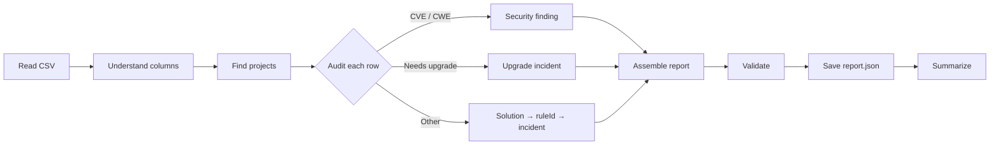

# Assessment Report Converter (CSV → report.json)

## What this skill does

You take a **row-oriented CSV** of migration issues and produce a canonical **`report.json`** conforming to the
assessment report schema. Once written to the versioned reports directory, the
report is picked up by the assessment UI and by the solution-resolution logic — exactly like a native AppCAT report.

**This is an LLM-driven conversion, not a fixed mapping script.** CSV layouts vary between tools and change over time,
so *you* read the file, decide what each column means, classify every row, and author `report.json`. You do **not**
rely on hard-coded column names.

A small helper script — [scripts/report_tools.sh](scripts/report_tools.sh) (bash + jq) or its PowerShell twin
[scripts/report_tools.ps1](scripts/report_tools.ps1) (PowerShell 7+) — provides only the deterministic pieces
you should never guess:

- **`list-solutions`** — discover the available migration solutions.
- **`rules-for-solution`** — get the canonical `ruleId`(s) for a chosen solution.
- **`upgrade-solutions`** — the canonical JDK / Spring Boot / Spring Framework / Jakarta EE upgrade solutions + ruleIds.
- **`validate`** — structural + consistency validation of the finished `report.json`.



## Input parameters

- `csv-path` (mandatory): Path to the source CSV file.
- `workspace-path` (optional): Output root. Defaults to the current directory. The report is written to
  `{workspace-path}/.github/modernize/reports/report-{reportId}/report.json`.
- `producer` (optional): A label identifying the source tool, stored in `report.producer` (e.g. `"Black Duck"`).
  Defaults to `"CSV import"`.

## When to use this skill

Use this when you have a **CSV** — not an AppCAT `report.json` — and you want it to behave like a real assessment
report: a Black Duck / third-party export, or a hand-maintained spreadsheet of migration issues. Do **not** use it to
run analysis from source code (that is the `assessment` skill).

## The helper script

The helper ships as two interchangeable implementations of the same CLI — use whichever fits the machine:
[scripts/report_tools.sh](scripts/report_tools.sh) (**bash + jq**) and
[scripts/report_tools.ps1](scripts/report_tools.ps1) (**PowerShell 7+**, no extra dependencies). Both behave
identically and never read the CSV. Run them from the `scripts/` directory.

```bash
# bash + jq
./report_tools.sh list-solutions [--query KW] [--type Formula|Chat] [--ids-only]
./report_tools.sh rules-for-solution <solutionId>
./report_tools.sh upgrade-solutions
./report_tools.sh validate <path/to/report.json>
```

```powershell
# PowerShell 7+
pwsh ./report_tools.ps1 list-solutions [--query KW] [--type Formula|Chat] [--ids-only]
pwsh ./report_tools.ps1 rules-for-solution <solutionId>
pwsh ./report_tools.ps1 upgrade-solutions
pwsh ./report_tools.ps1 validate <path/to/report.json>
```

- `list-solutions` prints the matching solutions from [scripts/solution-mapping.json](scripts/solution-mapping.json) as
  whole JSON objects (each always has `solutionId`, `name`, `type`, and `tooltip`; some also carry `effort` / `prompt`);
  `--query` filters by substring on id/name/tooltip.
- `rules-for-solution` prints `{ solutionId, ruleCount, rules: [{ruleId, sourceCategory}], preferredRuleId }`. An empty
  list means the solution has **no** rule (e.g. a security-only solution) — do not invent a ruleId.
- `upgrade-solutions` prints, per component (`jdk`, `spring-boot`, `spring-framework`, `jakarta-ee`), the `solutionId`
  and its resolved `preferredRuleId`.
- `validate` runs structural + cross-field consistency checks
  (incident→rule references, required `domain`/`category` rule fields, enum values, security-finding shape and dedupe, and
  `metadata.domains`↔content consistency). Exit code is `0` valid, `1` invalid, `2` when the report can't be read/parsed.
  It accepts a `--schema <path>` flag for CLI compatibility but ignores it — the checks are self-contained.

## Reference material

Detailed reference material is consolidated in the [Reference](#reference) section at the end of this file. The workflow
below links to the relevant part at the step where you need it — you do not have to open any separate files:

- [Report structure](#report-structure) — the top-level `report.json` shape and the authoring conventions the schema can't express (the schema owns the field shape).
- [Assessment domains](#assessment-domains) — the `metadata.domains` values and when to include each.
- [Security severity mapping](#security-severity-mapping) — normalizing a source CVE/CWE severity to the security `mandatory|potential|optional` scale.
- [Rule classification](#rule-classification) — the required `domain` / `category` rule fields that group and render a rule's incidents.

## Workflow

### Step 1 — Understand the report structure (do this first)

Read the authoritative schema [scripts/assessment-report.schema.json](scripts/assessment-report.schema.json) — it is
the source of truth for the field shape. The report is a single root object `{ version, producer, metadata, projects,
rules, security? }`, and `additionalProperties` is `false` almost everywhere (there is **no** `summary` object). The
[report structure reference](#report-structure) adds the authoring conventions the schema can't express.
You must know the required fields before authoring anything.

### Step 2 — Read and understand the CSV

Read the CSV file directly (headers + a representative sample of rows). Then **interpret the columns by meaning**,
since names and order vary by tool. Identify whichever of these the CSV actually carries (any may be absent):

- a **project / module / service** identifier,
- an **application** name,
- an issue **title** and **description**,
- a **severity / criticality / priority**,
- a **category / domain / type**,
- a **CVE / CWE** identifier,
- an **affected component / package / library** and its **version**,
- a **file** path and **line**,
- an **effort / story-point** estimate,
- a **reference / URL**.

When a concept is missing, leave the corresponding report field empty or at its default — never fabricate data.

### Step 3 — Determine the projects

Work out **how many projects** the CSV describes and group rows accordingly:

- If a project/module/service column exists, group rows by it — one project per distinct value, using that value
  as `project.path`.
- If the CSV has **no project information**, create a **single project** with `path` `"."` and minimal properties
  (`appName` `""`; leave optional `jdkVersion` / `frameworks` / `languages` / `tools` off or empty).
- Populate `project.properties` **only** from what the CSV actually provides; otherwise keep them empty. Only `appName`
  is required.

Every incident you create later belongs to exactly one of these projects.

### Step 4 — Audit each row, within its project

Classify every row into exactly one of three branches and attach the result to the row's project. Every rule you add to
`rules{}` must set its `domain` and `category` **fields** (that is what groups and renders its incidents) — see
[rule classification](#rule-classification). Incidents do **not** require any label.

1. **CVE / CWE → security finding (directly).**
   When a row carries a `CVE-…` / `CWE-…` identifier (or unambiguously describes one), add a security finding
   to `report.security[]`. Capture **as much of the column as possible**: `id` (the CVE/CWE token), `title`, `category`,
   `severity` (the security scale `mandatory | potential | optional` — normalize the source severity per
   [security issue severity mapping](#security-severity-mapping)), `description`, `evidence.files`
   (affected paths), `evidence.explanation`, and optional `storyPoint`. **Merge by id** — one finding per CVE/CWE;
   accumulate evidence files and keep the strongest severity (`mandatory` > `potential` > `optional`). Security
   findings are **not** incidents; they live only in `report.security[]` (there is no summary to count them in).

2. **Needs a major-component version upgrade → upgrade incident.**
   If the row implies upgrading a major component — **JDK**, **Spring Boot**, **Spring Framework**, or **Java EE /
   Jakarta EE** (e.g. a CVE against `spring-boot`, an out-of-support runtime, an explicit "upgrade JDK") — run
   the `upgrade-solutions` command, pick the component, and use its `preferredRuleId`. Add that rule to `rules{}`
   (`severity: "mandatory"`, `domain: "java-upgrade"`, a `category`, a reasonable `effort`) and add an **incident** to the
   project — one upgrade rule per component per project, one incident per triggering row. A CVE that
   implies an upgrade produces **both** a security finding (branch 1) **and** an upgrade incident — that is what makes the
   upgrade resolve as a migration solution.

3. **Any other issue → solution → ruleId → incident.**
   Find the migration solution that fits the issue with
   the `list-solutions --query <keyword>` command, then get its canonical ruleId with
   `rules-for-solution <solutionId>` (use `preferredRuleId`). Add that rule to `rules{}` (with `domain`,
   `category`, `severity`, `effort`) and an incident to the project. If no solution fits, you may still record the issue
   with a clear **synthetic** ruleId (it just won't
   carry an automatic Formula solution) — or leave it for the "remaining" list in your summary. Either way, report it.

#### Process rows in parallel

Classifying a row is independent work, so for large CSVs do it concurrently rather than one row at a time:

- **Batch the rows** (e.g. 20–50 per batch, or one batch per project) and dispatch the batches **in parallel** — launch
  several `Explore`/worker subagents at once, each auditing its batch into a partial result (security findings, upgrade
  hits, and ordinary incidents with their resolved ruleIds). Ask each worker to return structured JSON; it does **not**
  write files.
- **Share the deterministic lookups.** Run the `upgrade-solutions` command and the `list-solutions` /
  `rules-for-solution` queries **once up front** (results are stable) and pass them to the workers, so parallel batches
  don't repeat the same lookups or race on them.
- **Keep workers side-effect free**, then **merge sequentially** in one place so shared state stays correct:
  - **Security findings** — merge by `id` (one finding per CVE/CWE; union `evidence.files`, keep the strongest severity).
  - **Upgrade rules** — collapse to one rule per `(project, component)`; keep every triggering incident.
  - **`incidentId`s** — assign `"<ruleId>/<n>"` **after** the merge, never inside a worker (so ids are deterministic
    regardless of batch order).
- If the CSV is small, just process the rows sequentially — the parallel split only pays off at scale.

### Step 5 — Assemble the report and finalize metadata

There is **no** `summary` object to compute — assemble the top-level document and fill `metadata`:

- `projects[]` = your projects, each with `properties` (only `appName` required) and its `incidents[]`.
- `rules{}` = every distinct rule you referenced, keyed by ruleId, each with `id`, `title`, `severity`, `effort`,
  `domain`, and `category`.
- `report.security[]` = the deduped findings (omit or leave empty when there are none).
- `metadata.domains` = the assessment domains your report actually has content for, consistent with your `rule.domain`
  values — see [assessment domains](#assessment-domains).
- `metadata.mode` (optional) = `"full"` when any security finding exists, else `"issue-only"`.
- `metadata.status` = `"completed"`; `metadata.targetIds` = the target ids in scope (may be empty).
- `metadata.id` (and the report-directory id) = `analysisStartTime` formatted `yyyyMMddHHmmss` (UTC); use the current UTC
  time when the CSV has no timestamp.

### Step 6 — Write and validate

Write `report.json` to the versioned location ([Output location](#output-location)), then validate and fix until clean:

```bash
# bash + jq
./report_tools.sh validate "<workspace>/.github/modernize/reports/report-<id>/report.json"
# …or PowerShell 7+
pwsh ./report_tools.ps1 validate "<workspace>/.github/modernize/reports/report-<id>/report.json"
```

Resolve every reported consistency error before finishing.

### Step 7 — Summarize for the user

Report a concise conversion summary:

- **Converted rows** — number of security findings (CVE/CWE), upgrade incidents (with components), and ordinary issue
  incidents (with the solutions they mapped to); plus the project / rule / incident counts and the report path + id.
- **Remaining rows** — rows you could not confidently map, and *why* (no matching solution, ambiguous column, missing id).
- **Suggestions** — concrete next steps (e.g. pick a specific solution for a remaining row, add a project column to the
  CSV, supply severities), so the user can close the gaps.

## Output location

- `{workspace-path}/.github/modernize/reports/report-{reportId}/report.json`
- `reportId` = the report's `metadata.id` from Step 5 (`analysisStartTime` as `yyyyMMddHHmmss`, UTC).
- Consider copying the original CSV next to `report.json` as `source.csv` for provenance.

## Success criteria

- ✅ `report.json` is written to the versioned reports directory and the `validate` command reports **VALID**.
- ✅ Projects reflect the CSV (one per module/service, or a single project with `appName: ""` when none is given).
- ✅ CVE/CWE rows are `security[]` findings (deduped by id) with a `mandatory|potential|optional` severity; `mode` is `full`.
- ✅ Rows implying a JDK / Spring Boot / Spring Framework / Jakarta EE upgrade add a mandatory upgrade incident whose
  `ruleId` came from the `upgrade-solutions` command.
- ✅ Other issues map to a solution's canonical `ruleId` (via `list-solutions` + `rules-for-solution`) wherever one fits.
- ✅ Every rule carries `domain` and `category` fields; every incident's `ruleId` resolves to a rule in `rules{}`; CVE/CWE
  findings stay in `security[]`, not `incidents[]`.
- ✅ `metadata.domains` matches the report's content and the emitted `rule.domain` values (enforced by `validate`).
- ✅ The user gets a summary of converted rows, remaining rows, and suggestions.

## Troubleshooting

- **`validate` reports a consistency error** (e.g. an incident `ruleId` with no matching rule, or a
  `domains`/`security` mismatch) — the message names the exact field; fix that field.
- **Don't add fields the schema doesn't allow** (e.g. a `summary` object, or `issues`/`storyPoints` on a project). The
  helper's `validate` is lenient about extra keys, but the app's importer enforces `additionalProperties: false` and will
  reject the report — this schema has no summary. Keep to the documented shape.
- **A row has a CVE/CWE *and* needs an upgrade** — emit both: a `security[]` finding **and** an upgrade incident. They are
  not duplicates; the finding documents the vulnerability, the incident drives the upgrade solution.
- **No solution fits an issue** — `list-solutions --query` returns nothing useful. Record the issue with a synthetic,
  descriptive `ruleId` (no Formula will attach) or list it under "remaining" with a suggestion.
- **`rules-for-solution` returns an empty list** — that solution has no rule (often security-only). Don't fabricate a
  ruleId; handle the issue via the security-finding path or pick a different solution.
- **Wrong severity enum** — rule/incident severity is the 4-value `mandatory|potential|optional|information` enum;
  security-finding severity uses the same scale **minus `information`** (`mandatory|potential|optional`, since a finding
  is always at least optional). Don't use the old `critical|high|medium|low|info` values.

## Reference

Consolidated reference material. The workflow above links here at the step where each part is needed.

### Report structure

You author a single `report.json` conforming to the authoritative schema
[scripts/assessment-report.schema.json](scripts/assessment-report.schema.json). The schema is one root object
(draft-07, its sub-types live under `definitions`) with the top-level shape `{ version, producer, metadata, projects,
rules, security? }`. Read the schema for the exact required fields, types, and enums per object — it is the source of
truth and the `validate` command checks it, so this section does **not** restate the field list. `additionalProperties`
is `false` almost everywhere, so **do not invent fields** (there is no `summary` object, and projects have no `issues` /
`storyPoints`).

**Authoring rules of thumb** — the conventions and cross-field rules the schema can't fully express:

- `version` is the string `"1.0.0"` (the schema accepts any string; this is the value to use).
- Rule/incident `severity` is the enum `mandatory | potential | optional | information`. Map source severities by meaning
  (e.g. critical/blocker → `mandatory`, major/medium → `potential`, minor/low → `optional`, info → `information`).
- **Classification is done with rule fields, not labels.** Each `rules{}` entry sets `domain`
  (`cloud-readiness | java-upgrade | security`) and `category` (a free string heading) directly — see
  [Rule classification](#rule-classification). `rules{}.labels` and `incidents[].labels` are optional free-form arrays;
  you normally leave them out.
- Security-finding `severity` uses the report criticality scale `mandatory | potential | optional` (the rule `Severity`
  values minus `information` — a security finding is always at least optional) — normalize per
  [Security severity mapping](#security-severity-mapping).
- `metadata.domains` records which assessment domains the report has content for — see
  [Assessment domains](#assessment-domains). It must be consistent with the `rule.domain` values you emit.
- `incidentId` convention: `"<ruleId>/<n>"` (n is a per-rule counter).
- `locationKind` = `"source-file"` when a file path is present, else `"unknown"`.
- `status` is normally `"completed"`.
- `metadata.mode` is optional; use `"full"` when the report has security findings, else `"issue-only"`.

### Assessment domains

`metadata.domains` is a `string[]` recording which assessment **domains** produced the report. Allowed values are
`cloud-readiness`, `java-upgrade`, and `security`.

| Domain | Meaning | When to include it for a CSV conversion |
|--------|---------|------------------------------------------|
| `cloud-readiness` | Azure cloud-migration issues | any ordinary issue → solution incident (branch 3) |
| `java-upgrade` | JDK / Spring Boot / Spring Framework / Jakarta EE upgrades | any upgrade incident (branch 2) |
| `security` | CVE / CWE vulnerability findings | `report.security[]` is non-empty (branch 1) |

- The native Java default is `["cloud-readiness", "java-upgrade"]`.
- Set `metadata.domains` to **exactly the domains your report has content for** — don't list `security` with no
  findings, or `java-upgrade` with no upgrade incidents. `validate` flags a `security`/`report.security` mismatch in
  either direction.
- `metadata.domains` must be consistent with the `rule.domain` **field** on your rules — every `rule.domain` value you
  emit should appear in `metadata.domains`.

### Security severity mapping

A security finding's `severity` uses the report criticality scale — `mandatory | potential | optional`. This is the rule
`Severity` enum **minus `information`** (a security finding is always at least optional). The extension renders these
values directly, so there is no separate security severity scale and no conversion step.

**Map the source CVE/CWE severity by meaning to the nearest value** (case-insensitive):

| Source severity (CSV, case-insensitive) | Report `security[].severity` |
|-----------------------------------------|------------------------------|
| `critical` / `blocker`                  | `mandatory`                  |
| `high`                                  | `mandatory`                  |
| `medium` / `moderate`                   | `potential`                  |
| `low`                                   | `optional`                   |
| anything else / unknown / missing       | `optional`                   |

- When merging duplicate findings by `id`, keep the **strongest** severity (`mandatory` > `potential` > `optional`).
- Security findings live in `report.security[]` only; there is no `summary` object to key by severity. `validate` checks
  each finding's `severity` is one of the three values and that findings are unique by `id`.
- Include the `security` domain in `metadata.domains` whenever `report.security[]` is non-empty (and only then).

### Rule classification

In this schema a rule is classified with **fields on the rule object**, not with labels. Every `rules{}` entry is
**required** to carry a `domain` and a `category` (the `validate` command enforces both, and the schema rejects a
rule that is missing them).

| Field | Value | Effect |
|-------|-------|--------|
| `domain` | `cloud-readiness` \| `java-upgrade` \| `security` | Groups the rule under that domain tab. Use the same domain you list in `metadata.domains`. **Required.** |
| `category` | the issue category heading (e.g. `postgresql`, `java-version-upgrade`, `deprecated-apis`) | Shown as the group heading. **Required.** |

**Choosing `category` (and the source label).** Each mapped rule also has a `sourceCategory` in the solution mapping,
which you get from `rules-for-solution <solutionId>` (`rules[].sourceCategory`). The UI builds the group heading as
`category` when it **equals** `sourceCategory` (or `sourceCategory` is empty / `null`), otherwise as
`category (sourceCategory)`. So:

- When a rule's `sourceCategory` is **non-null**, set its `category` to **exactly that value** — e.g.
  `mi-postgresql` → rule `azure-database-postgresql-02000`, `sourceCategory: "postgresql"` → `category: "postgresql"`,
  which renders as one clean **Postgresql** heading (mismatching it, e.g. `category: "database"`, would render the
  doubled **Database (Postgresql)**).
- When `sourceCategory` is **`null`** (e.g. the JDK-upgrade rules), choose a sensible `category` yourself
  (e.g. `upgrade`) — it renders as-is.

**Labels are optional.** `rules{}.labels` and `incidents[].labels` are optional free-form `string[]`s in the schema.
Classification no longer depends on them, so you normally leave them out. The engine may still emit context labels
(`target=`, `os=`, `capability=`) on native reports, but when hand-authoring a CSV conversion you do not need any label
to make content render — the required `domain`/`category` **fields** do that.
